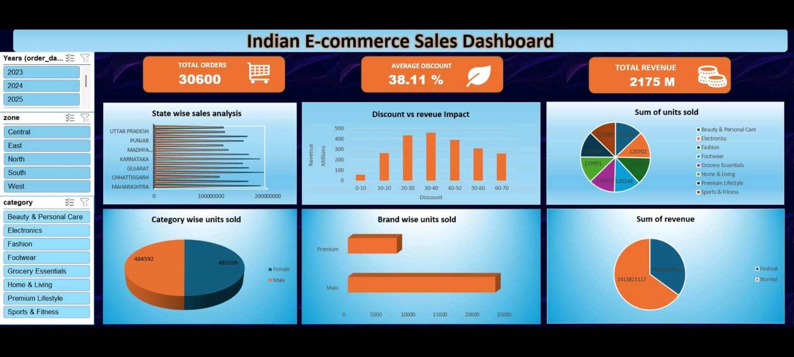

# 📊 Indian E-commerce Sales Dashboard

An interactive Excel dashboard designed to analyze Indian e-commerce sales performance and generate meaningful business insights.

## 📌 Project Overview

This project focuses on analyzing e-commerce sales data using Microsoft Excel.

The dashboard provides an interactive view of sales performance across different years, zones, states, categories, brands, discounts, and sales types.

## 🎯 Objectives

- Analyze overall sales performance
- Track total orders and revenue
- Analyze state-wise sales
- Understand the impact of discounts on revenue
- Analyze units sold across categories
- Compare brand performance
- Analyze revenue by sales type
- Provide an interactive dashboard for business analysis

## 📊 Key KPIs

| KPI | Value |
|---|---:|
| Total Orders | 30,600 |
| Average Discount | 38.11% |
| Total Revenue | 2.175B |

## 📈 Dashboard Features

### Interactive Filters

- Year
- Zone
- Category

### Visualizations

- State-wise Sales Analysis
- Discount vs Revenue Impact
- Category-wise Units Sold
- Brand-wise Units Sold
- Revenue by Sales Type
- Sales Performance Analysis

## 🛠️ Tools & Skills

- Microsoft Excel
- Pivot Tables
- Pivot Charts
- Slicers
- Excel Formulas
- Data Cleaning
- Data Analysis
- Data Visualization
- Dashboard Design

## 🖼️ Dashboard Preview

## 💡 Key Insights

- The dashboard provides a quick overview of overall e-commerce sales performance.
- Revenue changes across different discount ranges.
- Mass-market brands contribute a larger number of units sold compared with premium brands.
- Interactive filters allow users to analyze performance by year, zone, and category.

## 📂 Project Files

| File | Description |
|---|---|
| `Indian_Ecommerce_Sales_Dashboard.xlsx` | Interactive Excel dashboard |
| `Excel_Dashboard.jpeg` | Dashboard preview |

## 🎓 Learning Outcome

Through this project, I gained practical experience in:

- Data cleaning and preparation
- Pivot Tables and Pivot Charts
- Interactive dashboard creation
- KPI development
- Data visualization
- Business-oriented data analysis

## 👨‍💻 Author

**Ritesh Patil**

Aspiring Data Analyst

**Skills:** Excel | SQL | Power BI | Data Analysis
